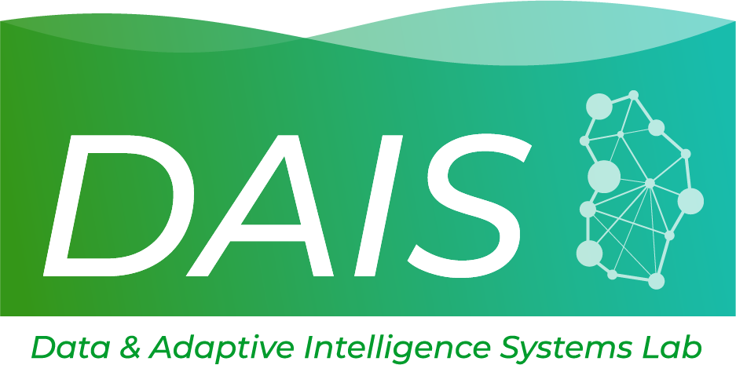
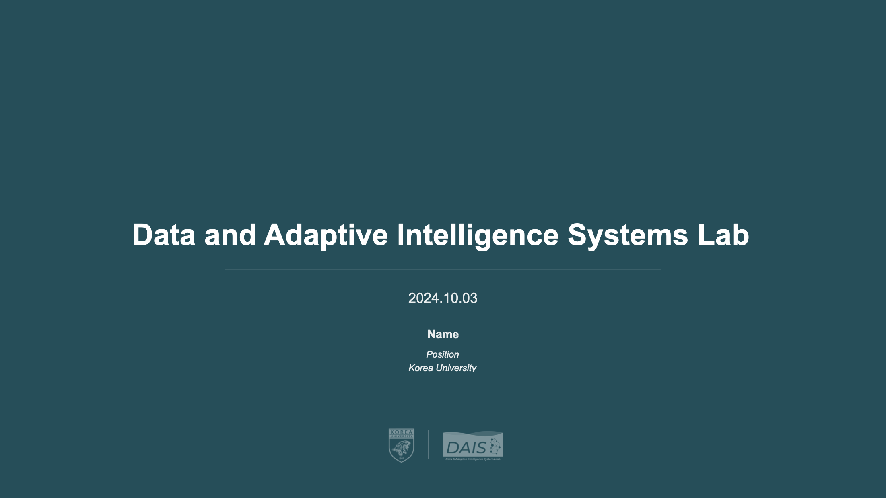
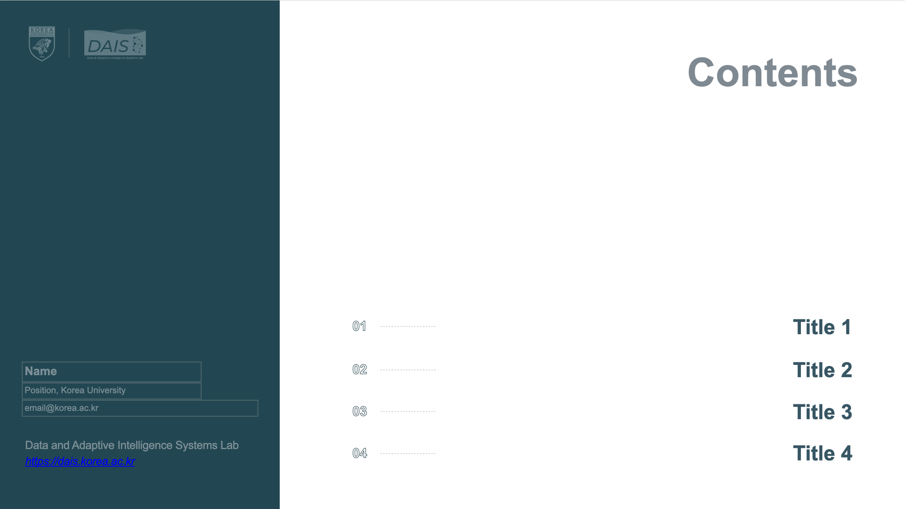
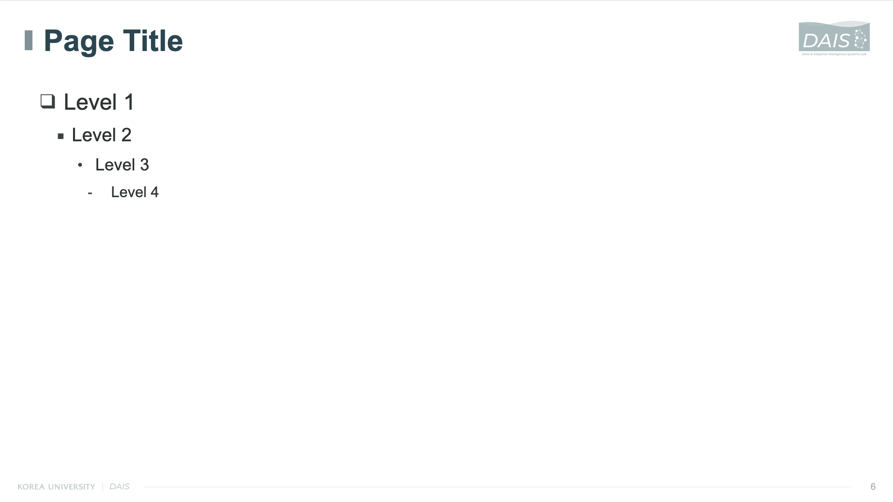

<!-- logo -->

 

## 📝 소개
다음 디자인 애셋에 대한 사용 가이드라인입니다.
- PPT 템플릿
- 폰트

 

## PPT 템플릿
컬러버전과 흑백버전이 제공되며 각 템플릿의 구성은 다음과 같습니다.

|시작|
|:---:|
||
|제목, 날짜, 이름, Position (Intern, MS, PhD, etc.)|

|목차n항목|
|:---:|
||
|목차 개수대로 (4, 5, 6) 골라 활용 가능하며   파워포인트 슬라이드 마스터에서 지우거나 더해 개수 수정이 가능합니다.|

|목차 구분|
|:---:|
||
|목차 간 구분 간지입니다.|

|본문|
|:---:|
||
|본문 페이지입니다. 줄에서 \tab키를 통해 level을 조절할 수 있습니다.|

 

## 폰트
세 개의 폰트 모두 무료 라이센스로 다양하게 활용하실 수 있습니다. 각 폰트별로 다음 언어로 적용 시 예시 슬라이들과 같이 활용 가능합니다.

- Arial: 한글, 영어
- Noto Sans KR: 한글
- Roboto: 영어

 
